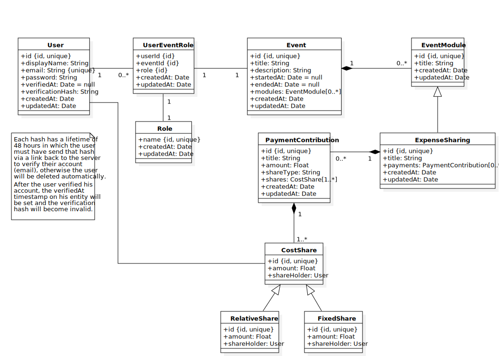

# eventify API

The eventify REST API, build with Spring.

**To quickstart, follow the README in
the [repository root](https://github.com/kelzenberg/eventify/blob/master/README.md).**

## Run API within IntelliJ IDEA

It is recommended to use IntelliJ IDEA Ultimate (not CE) with plugins:

- .env files support
- EnvFile
- JPA Support

This will ensure that the run configuration for the _IntelliJ IDEA_ in the `.run` folder  
automatically loads the correct environment profile and its env values from `../local.env`.  
We are using Java 14 with language level 11.

**The API will run on [https://localhost:8443](https://localhost:8443), with a self signed certificate.**

## Entities Schema

